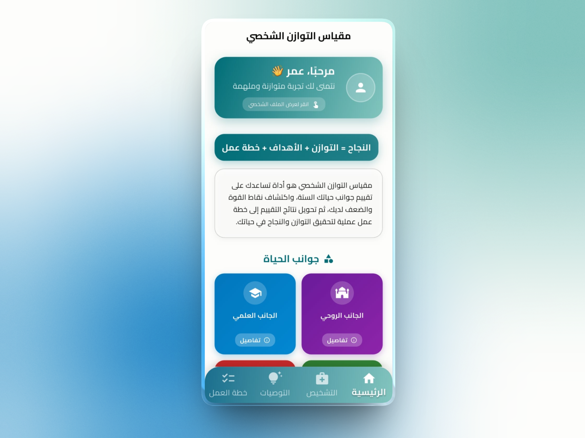

<p align="center">
  
  
  
  
  
</p>

<h1 align="center">
  ⚖️ Mekyas Tawazoun<br/>
  <sub>مقياس التوازن الشخصي</sub>
</h1>

<p align="center">
  <strong>Personal Balance & Self-Development Companion</strong><br/>
  Evaluate your life dimensions, visualize harmony, and take actionable steps toward a more balanced life.
</p>

<p align="center">
  <a href="#-features">Features</a> •
  <a href="#-screenshots">Screenshots</a> •
  <a href="#-tech-stack">Tech Stack</a> •
  <a href="#-architecture">Architecture</a> •
  <a href="#-installation">Installation</a> •
  <a href="#-author">Author</a>
</p>

---

## 📖 Introduction

**Mekyas Tawazoun (مقياس التوازن الشخصي)** is a modern Flutter application designed to help individuals assess and improve their personal balance across multiple life dimensions — such as health, productivity, relationships, spirituality, and personal growth.

Inspired by the concept of *“Tawazoun”* (balance), the app transforms self-reflection into an interactive digital experience through diagnostics, visual analytics, personalized recommendations, and actionable improvement plans.

The goal of the project is to help users better understand themselves, identify imbalance areas, and progressively build healthier habits and a more fulfilling lifestyle.

---

## ✨ Features

| Category | Features |
| :--- | :--- |
| 📊 **Diagnostic System** | Multi-dimensional life assessment with structured questions |
| 📈 **Balance Visualization** | Radar charts, progress indicators, and score analytics |
| 💡 **Recommendations** | Personalized improvement suggestions based on results |
| 📝 **Action Plans** | Create and manage self-improvement tasks and goals |
| 📅 **Progress Tracking** | Monitor evolution and consistency over time |
| 👤 **Profile Management** | User profile, preferences, and statistics |
| 🌙 **Theme Support** | Clean modern UI with dark/light mode |
| 🌍 **Localization** | Arabic-first experience with multilingual support |

---

# 🔍 Explore the Experience

<p align="center">
  <strong>User Journey — From Assessment to Growth</strong>
</p>

| Home Dashboard | Diagnostic Page | Results Page |
| :---: | :---: | :---: |
|  |  |  |
| *Overview of user balance and quick actions* | *Life dimensions assessment* | *Radar chart and score visualization* |

| Recommendations | Action Plan | Profile |
| :---: | :---: | :---: |
|  |  |  |
| *Personalized improvement suggestions* | *Task planning and progress tracking* | *User information and settings* |

| Statistics | Onboarding | Dark Mode |
| :---: | :---: | :---: |
|  |  |  |
| *Analytics and evolution tracking* | *Smooth onboarding experience* | *Modern dark theme interface* |

> 💡 All screens are fully responsive and optimized for mobile user experience.

---

# 🧭 App Workflow

```mermaid
graph LR
    A[Onboarding] --> B[Diagnostic Assessment]
    B --> C[Results & Analytics]
    C --> D[Recommendations]
    D --> E[Action Plan]
    E --> F[Progress Tracking]
    F --> G[Re-evaluation]
    G --> B
````

1. **Onboarding** – Discover the app and create your profile
2. **Diagnostic** – Answer questions across multiple life dimensions
3. **Results** – Analyze your balance score and radar chart
4. **Recommendations** – Receive personalized guidance
5. **Action Plan** – Create tasks and improvement goals
6. **Tracking** – Follow your evolution and maintain consistency

---

# 🛠️ Tech Stack

| Layer                  | Technology          |
| :--------------------- | :------------------ |
| **Framework**          | Flutter             |
| **Language**           | Dart                |
| **State Management**   | Provider / Riverpod |
| **Local Storage**      | SQLite / Hive       |
| **Charts**             | fl_chart            |
| **Navigation**         | go_router           |
| **Backend (Optional)** | Firebase            |
| **Localization**       | intl                |
| **Architecture**       | Clean Architecture  |

---

### ✅ Principles Used

* Separation of Concerns
* Reusable Components
* Scalable Folder Structure
* Responsive UI Design
* Clean State Management

---

# 📦 Installation

## Prerequisites

* Flutter SDK installed
* Dart SDK installed
* Android Studio / VS Code
* Emulator or physical device

## Clone the Repository

```bash
git clone https://github.com/YOUR_USERNAME/mekyas-tawazoun.git
cd mekyas-tawazoun
```

## Install Dependencies

```bash
flutter pub get
```

## Run the App

```bash
flutter run
```

---

# 🚀 Getting Started

After launching the application:

* Complete your profile setup
* Take the balance diagnostic
* Analyze your results
* Explore recommendations
* Build your action plan
* Track your personal growth journey

---

# 🔮 Future Improvements

* [ ] AI-powered recommendations
* [ ] Push notifications
* [ ] Cloud synchronization
* [ ] Export reports (PDF)
* [ ] Habit tracking system
* [ ] Gamification system
* [ ] Community challenges
* [ ] Smart reminders

---

# 💡 Why This Project Matters

> *“Balance is not something you find, it is something you create.”*

Many people struggle to maintain equilibrium between studies, work, health, relationships, and personal goals. Mekyas Tawazoun aims to simplify self-awareness and transform reflection into measurable progress.

This project combines:

* Mobile development
* UI/UX design
* Data visualization
* Productivity systems
* Self-improvement concepts

into one practical and meaningful mobile experience.

---

# 👨‍💻 Author

## Lyes

🎓 Third-year Computer Science Student at ESI Algiers
💻 Passionate about Mobile Development, Flutter, and Problem Solving

* GitHub: [https://github.com/YOUR_USERNAME](https://github.com/ilyesblidi)
* LinkedIn: [https://linkedin.com/in/YOUR_LINKEDIN](https://www.linkedin.com/in/lyes-blidi)

---

# 🤝 Contributing

Contributions, ideas, and suggestions are welcome.

1. Fork the repository
2. Create your feature branch
3. Commit your changes
4. Push your branch
5. Open a Pull Request

---

# 📄 License

This project is licensed under the MIT License.

---

<p align="center">
  Made with ❤️ using Flutter
</p>

<p align="center">
  ⚖️ Mekyas Tawazoun • مقياس التوازن الشخصي
</p>
```
